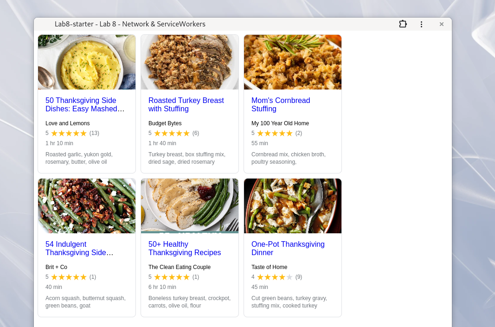

# Lab8-Starter

[even sadder yeehaw](https://yue-hua-x.github.io/Lab8-Starter/index.html)

### paragraph:

Service workers help the web app function when there is low or no network connectivity, helping the app function somewhat gracefully (as in not becoming completely dysfunctional) when network requests are slow. This is important as JS is single-threaded, which means that if it encounters a slow network request or some other task that takes a long time, the entire website's JS slows or stops. Service workers are able to take these tasks and perform them in the background so that the website still functions quickly even when time-intensive tasks are being performed.